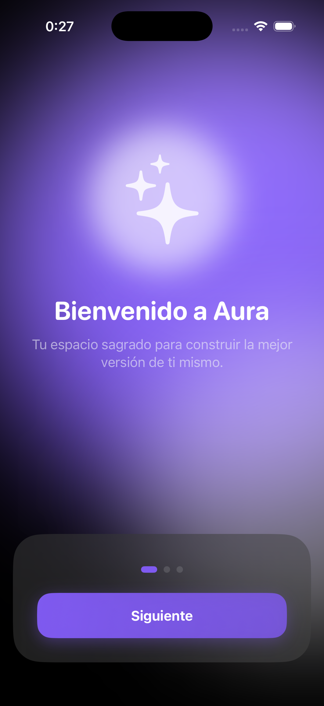
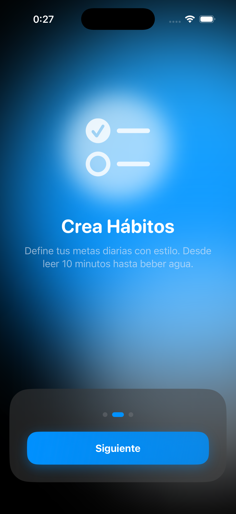
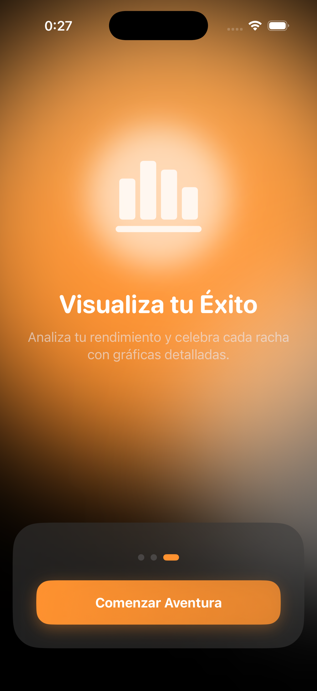
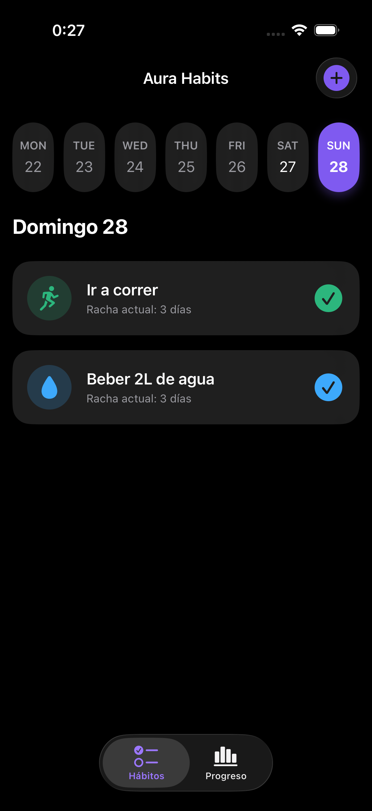
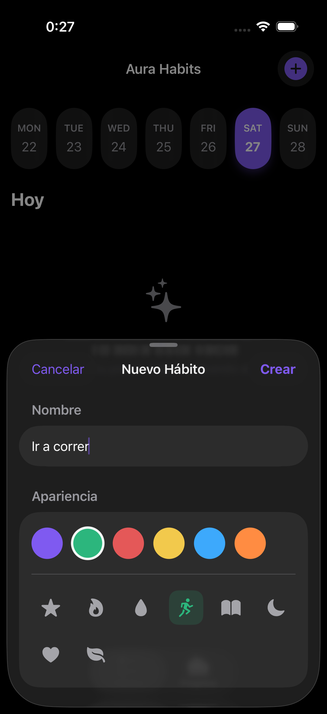
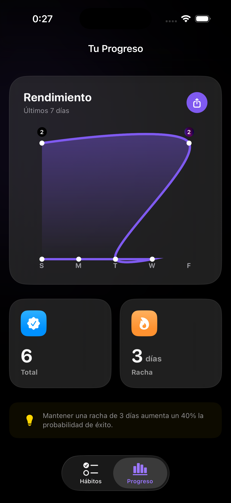
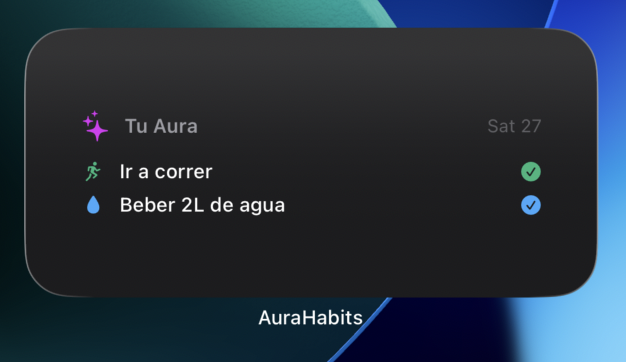

# Aura Habits ✨

**Aura Habits** es una aplicación de seguimiento de hábitos diseñada para iOS con un enfoque minimalista y una experiencia de usuario fluida. Permite a los usuarios construir rutinas, visualizar su progreso mediante gráficas detalladas y mantener el control desde su pantalla de inicio con widgets interactivos.

---

## 📸 Capturas de Pantalla

### Bienvenida y Onboarding
Acompañamos al usuario en su primera toma de contacto con una experiencia visual espectacular y fluida.

| Paso 1 | Paso 2 | Paso 3 |
| :---: | :---: | :---: |
|  |  |  |

---

### Gestión y Creación
Interfaz limpia para el día a día, con calendario semanal y tarjetas interactivas con feedback háptico.

| Tus Hábitos | Crear Hábito |
| :---: | :---: |
|  |  |

---

### Análisis y Acceso Rápido
Visualización de datos mediante Swift Charts y acceso inmediato desde el sistema. Para que el Widget luzca mejor, lo hemos emparejado con la vista de estadísticas.

| Estadísticas y Progreso | Widget Interactivo |
| :---: | :---: |
|  |  |

---

## 🛠 Tecnologías Utilizadas

* **SwiftUI**: Para una interfaz moderna y reactiva.
* **SwiftData**: Persistencia de datos eficiente y sincronizada mediante `ModelContainer`.
* **WidgetKit**: Widget para la pantalla de inicio con soporte para App Groups (`group.com.AuraHabits`).
* **Swift Charts**: Gráficas de rendimiento dinámicas para el seguimiento de progreso.
* **UserNotifications**: Sistema de recordatorios locales programables gestionado por `NotificationManager`.

## 🚀 Funcionalidades Clave

* **Calendario Semanal Interactivo**: Navegación sencilla entre días mediante `WeeklyCalendarView`.
* **Cálculo de Rachas**: Lógica robusta en el modelo `Habit` para medir la constancia diaria.
* **Microinteracciones**: Feedback háptico y animaciones de confeti (`ConfettiModifier`) al completar tareas.
* **Onboarding Dinámico**: Introducción visual al primer uso de la aplicación para guiar al usuario.

---

Desarrollado con ❤️ por José Manuel Jiménez
